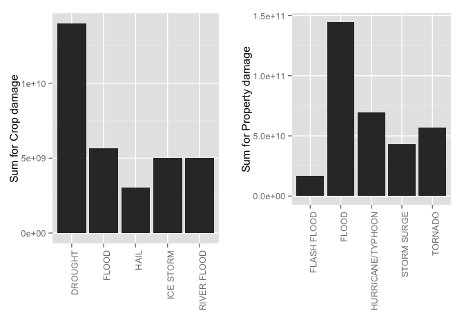

# StormData
#Weather events effect on health and economic problems in USA from 1950 to 2011

##Synopsis

Storms and other severe weather events can cause both public health and economic problems for communities and municipalities. Many severe events can result in fatalities, injuries, and property damage, and preventing such outcomes to the extent possible is a key concern. Results show than the event with the most injuries and fatalities across USA are Tornados and the event that caused the most damage in crops and property are the droughts and floods respectively


##Loading and Processing the Raw Data

Data was downloaded from [this link](https://d396qusza40orc.cloudfront.net/repdata%2Fdata%2FStormData.csv.bz2) and comes from U.S. National Oceanic and Atmospheric Administration's (NOAA) storm database. This database tracks characteristics of major storms and weather events in the United States, including when and where they occur, as well as estimates of any fatalities, injuries, and property damage.

The events in the database start in the year 1950 and end in November 2011. In the earlier years of the database there are generally fewer events recorded, most likely due to a lack of good records. More recent years should be considered more complete.


```r
remoteFile <- "https://d396qusza40orc.cloudfront.net/repdata%2Fdata%2FStormData.csv.bz2"
localZipFile <- "repdata%2Fdata%2FStormData.csv.bz2"
download.file(remoteFile, destfile = localZipFile, mode="wb", method="curl")
data <- read.csv("repdata%2Fdata%2FStormData.csv.bz2")
```
Dpyr package was used

```r
library(dplyr)
```

```
## 
## Attaching package: 'dplyr'
## 
## The following object is masked from 'package:stats':
## 
##     filter
## 
## The following objects are masked from 'package:base':
## 
##     intersect, setdiff, setequal, union
```

```r
library(ggplot2)
```

```
## Warning: package 'ggplot2' was built under R version 3.1.3
```

```r
library(tidyr)
library(gridExtra)
```

```
## Loading required package: grid
```
data$EVTYPE <- as.factor(toupper(data$EVTYPE))

##Results

###Across the United States, which types of events (as indicated in the EVTYPE variable) are most harmful with respect to population health?

First the data is grouped by the type of event EVTYPE and then the sum and mean of fatalities and injuries are calculated. Then the data is rearrange to only show one observation per event.

```r
EV_Health <- data %>% 
  group_by(EVTYPE) %>%
  summarise(Fatalities_sum = sum(FATALITIES, na.rm = TRUE), 
            Fatalities_mean = mean(FATALITIES, na.rm = TRUE), 
            injuries_sum = sum(INJURIES, na.rm = TRUE), 
            injuries_mean = mean(INJURIES, na.rm = TRUE)
            ) %>%
  gather(healthCq_summType, value, -EVTYPE) %>%
  separate(healthCq_summType, c("healthCq", "summType")) %>%
  spread(summType, value)
```

Sum and mean of fatalities and injuries is rank in descending order


```r
t1 <- EV_Health %>% 
  filter(healthCq == "Fatalities") %>%
  arrange(desc(sum), EVTYPE)
t2 <- EV_Health %>% 
  filter(healthCq == "injuries") %>%
  arrange(desc(sum))
t3 <- EV_Health %>% 
  filter(healthCq == "Fatalities") %>%
  arrange(desc(mean), EVTYPE)
t4 <- EV_Health %>% 
  filter(healthCq == "injuries") %>%
  arrange(desc(mean))
```

Here are the plots for only the first 5 events in the ranked tables

```r
p1 <- ggplot(data = t1[1:5,], aes(x = EVTYPE, y = sum )) + 
  geom_bar(stat = "identity") +
  theme(axis.text.x = element_text(angle = 90, hjust = 1)) +
  ylab("Sum of Fatalities") + xlab("")

p2 <- ggplot(data = t2[1:5,], aes(x = EVTYPE, y = sum )) + 
  geom_bar(stat = "identity") +
  theme(axis.text.x = element_text(angle = 90, hjust = 1)) +
  ylab("Sum of Injuries") + xlab("")

p3 <- ggplot(data = t3[1:5,], aes(x = EVTYPE, y = mean )) + 
  geom_bar(stat = "identity") +
  theme(axis.text.x = element_text(angle = 90, hjust = 1)) +
  ylab("Mean of Fatalities") + xlab("")

p4 <- ggplot(data = t4[1:5,], aes(x = EVTYPE, y = mean )) + 
  geom_bar(stat = "identity") +
  theme(axis.text.x = element_text(angle = 90, hjust = 1)) +
  ylab("Mean of Injuries") + xlab("")

grid.arrange(p1, p2, ncol=2)
```

 

```r
grid.arrange(p3, p4, ncol=2)
```

 

The most harmful weather event to population health is Tornado.It is cause for both the highest fatalities and the highest injuries across United States.

###Across the United States, which types of events have the greatest economic consequences?

First step is isolate the columns involved in the analysis for economic damage


```r
EV_Dmg <- data %>%
  select(EVTYPE, PROPDMG, PROPDMGEXP, CROPDMG, CROPDMGEXP)
```
Then a table was created to represent the values of the exponents 

```r
ExpVal <- data.frame(EXP = c("", "-", "+", "?", "0", "1", "2", "3", "4", "5", "6", "7", "8", "B", "k", "K", "m", "M", "h", "H"), 
          VALUE = c( 0 ,0 ,0 ,0 ,1 ,1 , 100, 1000, 10000, 100000, 1000000, 10000000, 100000000, 1000000000, 1000, 1000, 1000000, 1000000, 100, 100))
```
Values for exponents were replaced and 2 new columns created showing the real value for crop and property damage

```r
# loop replacing values with ExpVal
for(i in 1:nrow(ExpVal)){
  levels(EV_Dmg$PROPDMGEXP)[levels(EV_Dmg$PROPDMGEXP)==ExpVal$EXP[i]] <- ExpVal$VALUE[i]
  levels(EV_Dmg$CROPDMGEXP)[levels(EV_Dmg$CROPDMGEXP)==ExpVal$EXP[i]] <- ExpVal$VALUE[i]
}
# 2 new columns with damage value times damage exponent
EV_Dmg<-mutate(EV_Dmg, PROPDMGVAL = PROPDMG*as.numeric(as.character(PROPDMGEXP)))
EV_Dmg<-mutate(EV_Dmg, CROPDMGVAL = CROPDMG*as.numeric(as.character(CROPDMGEXP)))
```

Table for the sum of damanges grouped by Event type

```r
EV_Dmg<- EV_Dmg %>%
  group_by(EVTYPE) %>%
  summarise(Property_sum = sum(PROPDMGVAL, na.rm = TRUE),  
            Crop_sum = sum(CROPDMGVAL, na.rm = TRUE)) %>%
  gather(DMG_summType, value, -EVTYPE) %>%
  separate(DMG_summType, c("DMG", "summType")) %>%
  spread(summType, value)
```
Sum and mean of crop and property damange and is ranked in descending order

```r
t5 <- EV_Dmg %>% 
  filter(DMG == "Crop") %>%
  arrange(desc(sum), EVTYPE)
t6 <- EV_Dmg %>% 
  filter(DMG == "Property") %>%
  arrange(desc(sum))
```
Here are the plots for only the first 5 events in the ranked tables

```r
p5 <- ggplot(data = t5[1:5,], aes(x = EVTYPE, y = sum )) + 
  geom_bar(stat = "identity") +
  theme(axis.text.x = element_text(angle = 90, hjust = 1)) +
  ylab("Sum for Crop damage") + xlab("")

p6 <- ggplot(data = t6[1:5,], aes(x = EVTYPE, y = sum )) + 
  geom_bar(stat = "identity") +
  theme(axis.text.x = element_text(angle = 90, hjust = 1)) +
  ylab("Sum for Property damage") + xlab("")

grid.arrange(p5, p6, ncol=2)
```

 

Drought caused more economic damage to crops and Flood caused more property damage
